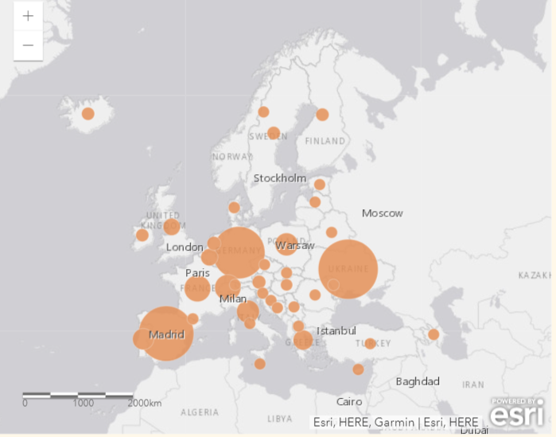

# Management-related questions

## Trends of IAS

### Number of IAS

### Area of IAS

### Impacts of IAS

### Impacts on biodiversity

## Management measures

### Measures implemented

### Number of measures implemented

## Perceptions

### Limitations and research support

# Context-related questions

## Participation

**Responses by countries:**

*Tap on the map to navigate to the web map*

**Responses by regions:**

*Tap on the map to navigate to the web map*

## Area and managers

### Environment

### Area managed and managers experience

*From left to right: protection of the area, size of the area, the affiliation of the managers and years' experience of the managers.*

---
*This material is licensed under CC BY-NC-ND. This license allows reusers to copy and distribute the material in any medium or format in unadapted form only, for noncommercial purposes only, and only so long as attribution is given to the creator.*

*CC BY-NC-ND includes the following elements:
BY – Credit must be given to the creator
NC – Only non-commercial uses of the work are permitted
ND – No derivatives or adaptations of the work are permitted*
