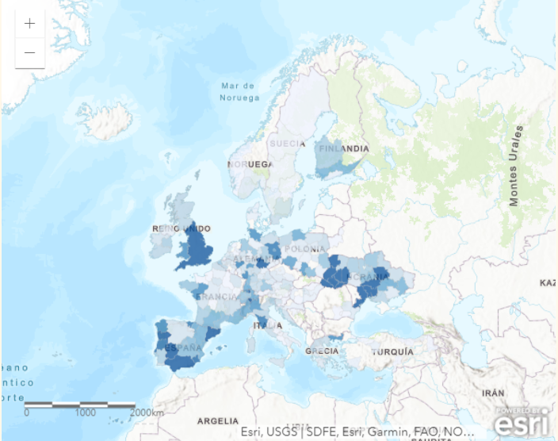

# Management-related questions

## Trends of IAS

### Number of IAS


### Area of IAS


```{r Area of IAS}
g_area <- plotbar(.data = data_cm,
                  var_starts = "area", 
                  env_cm = NA, 
                  env_detail = NA, 
                  title = "Area occupied by IAS",
                  type = "taxons", 
                  .levels = answers_taxons)
g_area
```

### Impacts of IAS


```{r Impacts of IAS}
g_impact <- plotbar(.data = data_clean,
                    var_starts = "impact", 
                    env_cm = NA, 
                    env_detail = NA, 
                    title = "Impacts generated by IAS",
                    type = "impacts", 
                    .levels = answers_impacts)
g_impact
```

### Impacts on biodiversity


```{r Impacts on biodiversity}
g_impact_bd <- plotbar(.data = data_cm,
                       var_starts = "impacts_bd", 
                       env_cm = NA, 
                       env_detail = NA, 
                       title = "Impacts on biodiversity generated by IAS",
                       type = "taxons", 
                       .levels = answers_taxons)
g_impact_bd
```

## Management measures


### Measures implemented


### Number of measures implemented


## Perceptions

### Limitations and research support


# Context-related questions

## Participation

Responses by countries:

[](https://arcg.is/1i5a5q)

Tap on the map to navigate to the web map.

Responses by regions:

[](https://arcg.is/1vS9Ce)

Tap on the map to navigate to the web map.

## Area and managers

### Environment


### Area managed and managers experience


